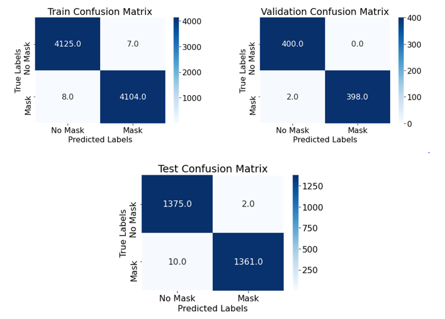

# Face-Mask-Detector
With the onset of the COVID-19 pandemic, the
whole world is in turmoil and is thinking of innovative solutions
to prevent the spread of the virus. As a precautionary measure,
people around the world are wearing masks to avoid contracting
this virus. While some are following and taking this measure,
some are not still not following despite official advice from the
government and public health agencies. In this project, a face mask
detection model that can accurately detect whether a person
is wearing a mask or not is implemented. The
model architecture uses MobileNetV2 which is a lightweight
convolutional neural network therefore requires less
computational power and can be easily embedded in computer
vision systems and mobile. As a result, it can create a low-cost
mask detector system which can help to identify whether a
person is wearing a mask or not and act as a surveillance system. 
The model has two-stage detector framework and employs 
transfer learning using MobileNetV2.The face detector model achieved 
high accuracy of 99.98% on training data, 99.56% on validation data and 99.75% on testing data.

<h2> Results </h2>

<h3> Confusion Matrix </h3>

<h3> Accuracy and Loss Graph </h3>
                                 

<h3> Face mask detector applied on real-life images </h3>
                                                                  

<h3> Future Scope </h3>
Working on increasing the accuracy and practicality of the model as well as trying one-detector framework such as YOLO
